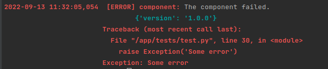

# Mantra Logging
The complex logging system with support of log metadata and delivery to [Grafana Loki](https://grafana.com/oss/loki/).

## Simple stdout/stderr colorized output
One example is more than a thousand words.

```python
from mantra_logger import setup_logging, get_logger

setup_logging(level='DEBUG')
logger = get_logger('component', meta={'version': '1.0.0'})

logger.debug('Loading resources for the component')
logger.info('Initialize of the component')
logger.warning('The component is not ready')
logger.error('The component failed.', 
             meta={'inputs': {'A': 1, 'B': 2}})
logger.critical('The component unexpected failed.', 
                meta={'attrs': {'A': 1, 'B': 2}})
```
*Console output:*


### Exceptions
```python
from mantra_logger import setup_logging, get_logger

setup_logging()
logger = get_logger('component', meta={'version': '1.0.0'})

try:
    raise Exception('Some error')
except Exception as ex:
    logger.error('The component failed.', exc_info=True)
```
*Console output:*




## Advanced configuration
The Mantra Logging supports a declarative configuration alike as [logging.config](https://docs.python.org/3/library/logging.config.html).
But this support profiles as well. It's mean we can declare many logging profiles and switch between them. Default profile is called `default`.

We can use yaml file as configuration file (see next):
```yaml
profiles:
  default:                             
    # Default profile
    filters:
      warning:                          
        # This is a filter for stdout logger, that enable only logs with level lower than WARNING. 
        # For logs with WARNING and higher we use stderr logger. 
        class: mantra_logger.LowerLogLevelFilter
        level: WARNING

    formatters:
      colored:
        # This is stdout/sterr formatter. 
        class: mantra_logger.LogColorFormatter
        fmt: "%(LEVEL_COLOR)s%(asctime)s\t [%(levelname)s] %(name)s:%(COLOR_RESET)s %(message)s"
        COLOR_PING: "\x1b[1;35m"          # We can declare own color
        COLOR_WARNING: '#COLOR_PING'      # and use it as color for warnings.
      loki:
        # This is formatter of loki messages.
        class: mantra_logger.loki.LokiLogFormatter

    handlers:
      stdout:
        # This is a stdout handler
        class: logging.StreamHandler
        stream: ext://sys.stdout
        formatter: colored
        filters:
          - warning
      stderr:
        # This is a stderr handler
        class: logging.StreamHandler
        stream: ext://sys.stderr
        formatter: colored
        level: WARNING        
      loki:
        # This is a loki handler
        class: mantra_logger.loki.LokiQueueHandler        
        formatter: loki
        strategy: random            # (options: all, fallback, random)
        timeout: 5
        urls:
          - "http://loki1:3100/loki/api/v1/push"
          - "http://loki2:3100/loki/api/v1/push"
          - "http://loki3:3100/loki/api/v1/push"
        meta:
          # mantra_logger handlers accept metadata as well. Standard logging handlers do not!
          stage: dev
          ip: 192.168.1.10                
                  

    loggers:
        root:          
          level: INFO
          handlers:
            - stdout
            - stderr        
            - loki
        'urllib3.connectionpool': 
          level: WARNING

  debug:                              
    # The second profile debug
    inherited: default
    # This profile inherits from default profile and overwrite only root log level. 
    loggers:
        root:
          level: DEBUG
```


```python
import yaml
from mantra_logger import setup_logging, get_logger

def get_yaml(filename):
    with open(filename, 'r+') as fd:
        return yaml.safe_load(fd)
    
schema = get_yaml('test.yaml')
setup_logging(profiles=schema.get('profiles'))

logger = get_logger('component')

logger.debug('Loading resources for the component')
logger.info('Initialize of the component')
logger.warning('The component is not ready')
```
The console output is the same as above, but now we send logs to Loki as well.

*Loki output:*


